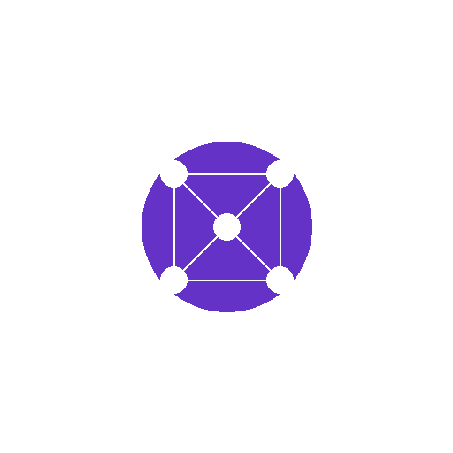

# Nirman – AI Web App Builder 🚀

<div align="center">



### **"Soch lo, Bana do"** – Just Think It, Build It

[](https://github.com/noobdeveshjha/Nirman/releases/tag/v1.0.0)
[]()
[]()
[]()

</div>

---

## 🎯 What is Nirman?

**Nirman** (निर्माण = "Creation" in Hindi) is an **AI-powered web app builder** that transforms your ideas into fully functional websites in seconds. No coding required – just describe what you want in plain English or Hindi, and watch the magic happen.

### The Problem We Solve

Building a website traditionally requires:
- 📚 Learning HTML, CSS, JavaScript
- ⏰ Weeks or months of development time
- 💰 Hiring expensive developers
- 🔧 Dealing with hosting, deployment, and maintenance

### The Nirman Solution

With Nirman, you simply:
1. **💬 Chat** – Describe your website idea in natural language
2. **🤖 AI Builds** – Our AI agents plan and generate production-ready code
3. **👀 Preview** – See your website live in real-time
4. **🚀 Deploy** – One-click deployment to GitHub Pages

### Example Prompts → Websites

| What You Say | What You Get |
|--------------|--------------|
| "Create a food delivery website like Swiggy" | Full landing page with hero, menu, features, pricing |
| "Build a portfolio for a photographer" | Beautiful gallery, about section, contact form |
| "Make an e-commerce site for selling shoes" | Product grid, cart, checkout flow |
| "Design a SaaS dashboard for analytics" | Charts, metrics, sidebar navigation |

### Who is Nirman For?

- 🏢 **Small Businesses** – Get online in minutes, not months
- 🎨 **Designers** – Prototype ideas instantly
- 👨‍💻 **Developers** – Accelerate your workflow 10x
- 🎓 **Students** – Build portfolio projects easily
- 🚀 **Startups** – Launch MVPs in hours

---

## 🧠 How Nirman is Different

### Self-Learning AI
Unlike other builders, Nirman **learns from every project**:
- Remembers your preferred colors, fonts, layouts
- Gets better at understanding your style over time
- Applies winning patterns from successful projects

### Two-Phase Intelligence
1. **Planner Agent** – Analyzes your request, detects industry, creates detailed spec
2. **Builder Agent** – Generates optimized, production-ready code

### 17+ AI Providers
Choose the best AI for your needs from US, China, and Open Source:

| Region | Providers |
|--------|-----------|
| 🇺🇸 **US/Global** | OpenAI GPT-5, Gemini, Claude, Grok, Mistral, Cohere, Groq, Together, Perplexity, Fireworks, AI21 |
| 🇨🇳 **Chinese AI** | DeepSeek, Alibaba Qwen, Moonshot Kimi, 01.AI Yi, Zhipu GLM |
| 🤗 **Open Source** | Hugging Face Inference API |

### GitHub Integration 
- 🐙 Connect GitHub via OAuth
- 📦 Create repos automatically
- 📤 Push code with one click
- 🌐 Enable GitHub Pages instantly
- 🔗 Get live URL: `username.github.io/project-name`

---

## ✨ Features in v1.0.0

- 🤖 **Multi-Agent Coding System** - Intelligent agent routing with 5 specialized agents
- 🌍 **17 AI Providers** - All major AI models from US, China & Open Source
- 🐙 **GitHub Integration** - One-click deploy to GitHub Pages
- 🔗 **8+ App Integrations** - Vercel, Supabase, Firebase, MongoDB, Canva, Razorpay, Cashfree
- 🧠 **Self-Learning System** - Nirman learns from your projects
- 🎯 **Planner Agent** - Two-phase AI generation (Plan → Build)
- 📡 **SSE Streaming** - Real-time build progress
- 🔄 **Auto Mode** - Fully autonomous app building
- 🎨 **Modern UI** - Clean, responsive design with Tailwind CSS & shadcn/ui

### 🔗 External Integrations

| Integration | Category | Features |
|-------------|----------|----------|
| **GitHub** 🐙 | Deployment | Push code, Create repos, GitHub Pages |
| **Vercel** ▲ | Deployment | Deploy, Preview URLs, Custom domains |
| **Supabase** ⚡ | Backend | PostgreSQL, Auth, Storage, Edge Functions |
| **Firebase** 🔥 | Backend | Hosting, Firestore, Auth, Cloud Storage |
| **MongoDB Atlas** 🍃 | Database | Clusters, Backups, Data API |
| **Canva** 🎨 | Design | Create designs, Export, Templates |
| **Razorpay** 💳 | Payments | Orders, Subscriptions, Payouts (India) |
| **Cashfree** 💰 | Payments | Payments, Links, Settlements (India) |

### 🤖 Multi-Agent Coding System

Nirman includes a powerful multi-agent system:

| Agent | Icon | Description | Capabilities |
|-------|------|-------------|--------------|
| **CoderAgent** | 💻 | Writes & debugs code | Python, JS, TypeScript, Go, Java, Rust, Full-stack dev |
| **BrowserAgent** | 🌐 | Web research | Search, URL extraction, Article summarization |
| **FileAgent** | 📁 | File operations | Create, Read, Update, Delete files & directories |
| **PlannerAgent** | 🧠 | Task planning | Break down complex tasks, coordinate agents |
| **CasualAgent** | 💬 | General chat | Q&A, concept explanations, brainstorming |

**Smart Routing**: Automatically selects the best agent for your task, or choose manually!

**Pay Model Integration**:
| Plan | Requests/Day | Providers | Features |
|------|-------------|-----------|----------|
| Free | 100 | DeepSeek, Groq | Basic agents |
| Basic | 1000 | + OpenAI, Gemini | All agents |
| Pro | Unlimited | All providers | Priority |
| Enterprise | Unlimited | All + priority | Premium support |

## 🛠️ Tech Stack

| Layer | Technology |
|-------|------------|
| **Frontend** | React 18, Tailwind CSS, shadcn/ui |
| **Backend** | FastAPI (Python 3.11+) |
| **Database** | MongoDB |
| **AI Providers** | OpenAI, Gemini, Claude, Grok, DeepSeek, Mistral, Cohere, Groq, Together, Perplexity, Fireworks, AI21, Qwen, Moonshot, Yi, Zhipu, HuggingFace |
| **Integrations** | GitHub, Vercel, Supabase, Firebase, MongoDB Atlas, Canva, Razorpay, Cashfree |
| **Auth** | JWT + bcrypt |

## 📋 Prerequisites

- Node.js 18+
- Python 3.11+
- MongoDB (local or cloud)
- At least one AI API key

## 🚀 Quick Start

### 1. Clone & Setup Backend

```powershell
# Create virtual environment
cd backend
python -m venv .venv
.venv\Scripts\Activate.ps1

# Install dependencies
pip install -r requirements.txt

# Configure .env file
cp .env.example .env
# Edit .env with your API keys
```

### 2. Configure Environment Variables

Create `backend/.env` (copy from `.env.example`):
```env
# MongoDB
MONGO_URL=mongodb://localhost:27017
DB_NAME=nirman

# JWT Secret (change in production!)
JWT_SECRET=your-super-secret-jwt-key

# ============ AI PROVIDER API KEYS ============
# US/Global Providers
OPENAI_API_KEY=sk-...
GEMINI_API_KEY=AIza...
CLAUDE_API_KEY=sk-ant-...
GROK_API_KEY=xai-...
MISTRAL_API_KEY=...
COHERE_API_KEY=...
GROQ_API_KEY=gsk_...
TOGETHER_API_KEY=...
PERPLEXITY_API_KEY=pplx-...
FIREWORKS_API_KEY=...
AI21_API_KEY=...

# Chinese AI Providers
DEEPSEEK_API_KEY=sk-...
QWEN_API_KEY=sk-...
MOONSHOT_API_KEY=sk-...
YI_API_KEY=...
ZHIPU_API_KEY=...

# Open Source
HUGGINGFACE_API_KEY=hf_...

DEFAULT_AI_PROVIDER=gemini

# ============ INTEGRATIONS ============
# GitHub OAuth App
GITHUB_CLIENT_ID=your_github_oauth_app_client_id
GITHUB_CLIENT_SECRET=your_github_oauth_app_secret

# Vercel OAuth
VERCEL_CLIENT_ID=your_vercel_client_id
VERCEL_CLIENT_SECRET=your_vercel_client_secret

# Canva OAuth
CANVA_CLIENT_ID=your_canva_client_id
CANVA_CLIENT_SECRET=your_canva_client_secret

# MongoDB Atlas API
MONGODB_ATLAS_PUBLIC_KEY=your_atlas_public_key
MONGODB_ATLAS_PRIVATE_KEY=your_atlas_private_key

# ============ PAYMENTS ============
# Razorpay
RAZORPAY_KEY_ID=rzp_test_xxx
RAZORPAY_KEY_SECRET=xxx

# Cashfree
CASHFREE_APP_ID=your_cashfree_app_id
CASHFREE_SECRET_KEY=your_cashfree_secret_key
CASHFREE_ENV=sandbox
```

### 3. Run Backend

```powershell
cd backend
py -m uvicorn app.main:app --reload --port 8000
```

### 4. Setup & Run Frontend

```powershell
cd frontend
npm install
npm start
```

Frontend runs at `http://localhost:3000`, Backend at `http://localhost:8000`

## 🌟 Key Features

### 🤖 AI-Powered Builder
- **Chat Interface** - Describe what you want, AI builds it
- **Auto Mode** - Fully autonomous building with one prompt
- **17 AI Providers** - Choose from US, Chinese, and Open Source models
- **Live Preview** - See your app as it's being built

### 🤖 Multi-Agent Coding System
- **Smart Routing** - Automatically selects best agent for your task
- **5 Specialized Agents** - Coder, Browser, File, Planner, Casual
- **Agent Selection** - Manually choose agents in settings
- **Memory Support** - Agents remember conversation context
- **Code Execution** - Run Python, JavaScript, and more

### 🐙 GitHub Integration
- **OAuth Connect** - Securely link your GitHub account
- **Auto Deploy** - Push code with one click
- **GitHub Pages** - Enable hosting automatically
- **Live URLs** - Get instant `username.github.io/project` links

### 🧠 Self-Learning System
- **Personalization** - Learns your preferred themes, layouts, sections
- **Pattern Library** - Extracts winning patterns from successful projects
- **Auto-Fix** - Learns from errors to prevent future failures
- **Privacy First** - Your data stays yours (opt-in for global learning)

### 📡 SSE Build System
- **Real-time Progress** - Watch build events as they happen
- **Two-Phase Generation** - Planner Agent → Builder Agent
- **Industry Detection** - Auto-detects project type for better templates
- **Fallback Templates** - Works even when AI is unavailable

### 💼 Business Features
- **Subscription Plans** - Free, Pro, Business tiers
- **Wallet System** - Credit-based usage tracking
- **BYO API Keys** - Users can add their own AI keys
- **Admin Dashboard** - Full user/system management

## 📁 Project Structure

```
nirman/
├── backend/                    # FastAPI Backend
│   ├── app/
│   │   ├── main.py            # App entry + lifespan events
│   │   ├── core/
│   │   │   ├── config.py      # Environment config (17 AI keys)
│   │   │   └── security.py    # JWT auth
│   │   ├── db/
│   │   │   └── mongo.py       # MongoDB connection
│   │   ├── models/
│   │   │   ├── user.py
│   │   │   ├── project.py
│   │   │   ├── jobs.py        # Build jobs & events
│   │   │   ├── learning.py    # Self-learning models
│   │   │   └── integrations.py # GitHub/Vercel models
│   │   ├── routes/
│   │   │   ├── auth.py
│   │   │   ├── projects.py
│   │   │   ├── build.py       # SSE build endpoints
│   │   │   ├── learning.py    # Learning API
│   │   │   └── integrations.py # GitHub OAuth & deploy
│   │   └── services/
│   │       ├── ai_router.py       # 17 AI provider router
│   │       ├── coding_agent.py    # Multi-agent system (CoderAgent, BrowserAgent, etc.)
│   │       ├── github_service.py  # GitHub API integration
│   │       ├── planner.py         # Planner Agent prompts
│   │       ├── build_service.py   # SSE build worker
│   │       ├── learning_service.py # Learning engine
│   │       └── aggregator_jobs.py  # Background learning jobs
│   └── requirements.txt
│
├── frontend/                   # React Frontend
│   ├── src/
│   │   ├── App.js
│   │   ├── pages/
│   │   │   ├── Dashboard.jsx
│   │   │   ├── Builder.jsx    # Chat builder + GitHub deploy
│   │   │   ├── Build.jsx      # SSE build page
│   │   │   ├── Agent.jsx      # Multi-agent coding interface
│   │   │   ├── Integrations.jsx # GitHub/Vercel connect
│   │   │   ├── Settings.jsx   # Privacy controls
│   │   │   └── ...
│   │   ├── components/
│   │   │   ├── BuildChat.jsx  # SSE streaming UI
│   │   │   ├── CodingAgent.jsx # Agent chat component
│   │   │   └── ui/            # shadcn components
│   │   └── lib/
│   │       └── api.js         # API client
│   └── package.json
│
└── README.md
```

## 🔌 API Endpoints

### Authentication
| Method | Endpoint | Description |
|--------|----------|-------------|
| POST | `/api/auth/register` | Register new user |
| POST | `/api/auth/login` | Login user |
| GET | `/api/auth/me` | Get current user |

### Projects
| Method | Endpoint | Description |
|--------|----------|-------------|
| GET | `/api/projects` | List user projects |
| POST | `/api/projects` | Create project |
| GET | `/api/projects/{id}` | Get project |
| DELETE | `/api/projects/{id}` | Delete project |

### Build System (SSE)
| Method | Endpoint | Description |
|--------|----------|-------------|
| POST | `/api/projects/{id}/build` | Start build job |
| GET | `/api/jobs/{id}` | Get job status |
| GET | `/api/jobs/{id}/stream` | SSE event stream |
| POST | `/api/jobs/{id}/cancel` | Cancel build |

### Self-Learning
| Method | Endpoint | Description |
|--------|----------|-------------|
| GET | `/api/learning/preferences` | Get user preferences |
| PUT | `/api/learning/preferences` | Update preferences |
| PUT | `/api/learning/privacy` | Privacy settings |
| GET | `/api/learning/insights` | User insights |
| GET | `/api/learning/patterns` | Best patterns |

### Plans & Wallet
| Method | Endpoint | Description |
|--------|----------|-------------|
| GET | `/api/plans` | List plans |
| POST | `/api/plans/subscribe` | Subscribe |
| GET | `/api/wallet/balance` | Check balance |
| POST | `/api/wallet/add` | Add credits |

### GitHub Integration
| Method | Endpoint | Description |
|--------|----------|-------------|
| GET | `/api/integrations` | List all integrations |
| GET | `/api/integrations/github/auth-url` | Get OAuth URL |
| POST | `/api/integrations/github/callback` | OAuth callback |
| GET | `/api/integrations/github/status` | Connection status |
| GET | `/api/integrations/github/repos` | List repos |
| POST | `/api/integrations/github/repos` | Create repo |
| POST | `/api/integrations/github/deploy/{id}` | Deploy to GitHub |
| DELETE | `/api/integrations/github` | Disconnect |

### Extended Integrations
| Method | Endpoint | Description |
|--------|----------|-------------|
| GET | `/api/integrations/all-status` | All integrations status |
| **Vercel** | | |
| GET | `/api/integrations/vercel/auth-url` | Vercel OAuth URL |
| POST | `/api/integrations/vercel/callback` | OAuth callback |
| GET | `/api/integrations/vercel/projects` | List projects |
| POST | `/api/integrations/vercel/deploy` | Deploy to Vercel |
| **Supabase** | | |
| POST | `/api/integrations/supabase/connect` | Connect with token |
| GET | `/api/integrations/supabase/projects` | List projects |
| POST | `/api/integrations/supabase/projects` | Create project |
| **Firebase** | | |
| POST | `/api/integrations/firebase/connect` | Connect with service account |
| POST | `/api/integrations/firebase/deploy` | Deploy to Firebase |
| **MongoDB** | | |
| POST | `/api/integrations/mongodb/connect` | Connect Atlas |
| GET | `/api/integrations/mongodb/clusters` | List clusters |
| **Canva** | | |
| GET | `/api/integrations/canva/auth-url` | Canva OAuth URL |
| GET | `/api/integrations/canva/designs` | List designs |
| POST | `/api/integrations/canva/designs` | Create design |
| **Razorpay** | | |
| POST | `/api/integrations/razorpay/connect` | Connect Razorpay |
| POST | `/api/integrations/razorpay/orders` | Create order |
| POST | `/api/integrations/razorpay/verify` | Verify payment |
| **Cashfree** | | |
| POST | `/api/integrations/cashfree/connect` | Connect Cashfree |
| POST | `/api/integrations/cashfree/orders` | Create order |
| POST | `/api/integrations/cashfree/quick-payment` | Quick payment |

### Coding Agent (Multi-Agent System)
| Method | Endpoint | Description |
|--------|----------|-------------|
| POST | `/api/agent/process` | Process request with agent routing |
| GET | `/api/agent/status` | Get user status & remaining requests |
| GET | `/api/agent/models` | Get available models per plan |
| GET | `/api/agent/agents` | List all agents with capabilities |
| POST | `/api/agent/conversation` | Continue conversation with memory |
| GET | `/api/agent/conversations` | List user conversations |
| GET | `/api/agent/usage/history` | Get usage history |
| GET | `/api/agent/plans` | Get plan details |

## 🧠 Self-Learning Architecture

```
┌─────────────────────────────────────────────────────────────┐
│                    USER ACTIONS                              │
│  (prompts, builds, theme changes, section edits, deploys)   │
└─────────────────────────────────────────────────────────────┘
                              │
                              ▼
┌─────────────────────────────────────────────────────────────┐
│                   EVENT TRACKING                             │
│              (project_events collection)                     │
└─────────────────────────────────────────────────────────────┘
                              │
              ┌───────────────┼───────────────┐
              ▼               ▼               ▼
     ┌────────────┐   ┌────────────┐   ┌────────────┐
     │   USER     │   │  GLOBAL    │   │   ERROR    │
     │PREFERENCES │   │  PATTERNS  │   │ SIGNATURES │
     └────────────┘   └────────────┘   └────────────┘
              │               │               │
              └───────────────┼───────────────┘
                              ▼
┌─────────────────────────────────────────────────────────────┐
│                 PLANNER AGENT                                │
│    (uses preferences + patterns to improve planning)        │
└─────────────────────────────────────────────────────────────┘
                              │
                              ▼
┌─────────────────────────────────────────────────────────────┐
│                 BUILDER AGENT                                │
│      (generates code with learned optimizations)            │
└─────────────────────────────────────────────────────────────┘
```

### Privacy Controls
- **Personalization** (default: ON) - Learn from your own projects only
- **Global Learning** (default: OFF) - Opt-in to share anonymized patterns

## 🤖 Multi-Agent Architecture

```
┌─────────────────────────────────────────────────────────────┐
│                      USER REQUEST                            │
│            "Create a REST API for user management"          │
└─────────────────────────────────────────────────────────────┘
                              │
                              ▼
┌─────────────────────────────────────────────────────────────┐
│                    AGENT ROUTER                              │
│         classify_task() → estimate_complexity()              │
│    Analyzes: keywords, patterns, complexity, intent          │
└─────────────────────────────────────────────────────────────┘
                              │
         ┌────────────────────┼────────────────────┐
         │                    │                    │
         ▼                    ▼                    ▼
┌──────────────┐    ┌──────────────┐    ┌──────────────┐
│   SIMPLE     │    │   MODERATE   │    │   COMPLEX    │
│  CoderAgent  │    │ CoderAgent + │    │ PlannerAgent │
│    alone     │    │   FileAgent  │    │ coordinates  │
└──────────────┘    └──────────────┘    └──────────────┘
                                               │
                              ┌────────────────┼────────────────┐
                              ▼                ▼                ▼
                     ┌──────────────┐ ┌──────────────┐ ┌──────────────┐
                     │ CoderAgent   │ │ BrowserAgent │ │  FileAgent   │
                     │   💻 Code    │ │  🌐 Research │ │  📁 Files    │
                     └──────────────┘ └──────────────┘ └──────────────┘
                              │                │                │
                              └────────────────┼────────────────┘
                                               ▼
                              ┌─────────────────────────────────┐
                              │         FINAL RESPONSE          │
                              │  Code + Files + Documentation   │
                              └─────────────────────────────────┘
```

### Agent Capabilities

| Agent | Specialization | Example Prompts |
|-------|----------------|-----------------|
| **CoderAgent** 💻 | Code generation, debugging, optimization | "Create a FastAPI server", "Debug this function" |
| **BrowserAgent** 🌐 | Web research, documentation lookup | "Research React hooks best practices" |
| **FileAgent** 📁 | File CRUD, project scaffolding | "Create project structure for Express app" |
| **PlannerAgent** 🧠 | Complex task decomposition | "Build a complete e-commerce app" |
| **CasualAgent** 💬 | General Q&A, explanations | "Explain how async/await works" |

## 🔧 Configuration

### AI Providers

Nirman supports 17 AI providers with direct API calls:

| Provider | Model | Best For |
|----------|-------|----------|
| **OpenAI** | gpt-4o / gpt-5 | Complex projects, highest accuracy |
| **Gemini** | gemini-1.5-flash | Speed, cost-effective |
| **Claude** | claude-sonnet-4-20250514 | Creative, detailed designs |
| **Grok** | grok-2-latest | Fast, conversational |
| **DeepSeek** | deepseek-chat | Coding, cost-effective |
| **Mistral** | mistral-large-latest | European, balanced |
| **Cohere** | command-r-plus | Enterprise, RAG |
| **Groq** | llama-3.3-70b | Ultra-fast inference |
| **Together** | Meta-Llama/Llama-3.3-70B | Open source models |
| **Perplexity** | llama-3.1-sonar-huge | Research, citations |
| **Fireworks** | llama-v3p1-405b | High performance |
| **AI21** | jamba-1.5-large | Enterprise |
| **Qwen** | qwen-max | Chinese, multilingual |
| **Moonshot** | moonshot-v1-128k | Long context |
| **Yi** | yi-large | Creative writing |
| **Zhipu** | glm-4-plus | Chinese, enterprise |
| **HuggingFace** | Qwen/Qwen2.5-72B | Open source, free |

### GitHub OAuth Setup

1. Go to **GitHub Settings** → **Developer Settings** → **OAuth Apps**
2. Click **New OAuth App**
3. Set **Authorization callback URL** to: `http://localhost:3000/integrations`
4. Copy **Client ID** and **Client Secret** to `.env`

### Database Collections

| Collection | Purpose |
|------------|---------|
| `users` | User accounts |
| `projects` | User projects |
| `build_jobs` | Build job status |
| `build_events` | SSE events |
| `project_events` | Learning events |
| `user_preferences` | Personalization |
| `pattern_library` | Winning patterns |
| `error_signatures` | Auto-fix library |
| `user_integrations` | GitHub/Vercel tokens |
| `oauth_states` | OAuth state tokens |
| `deployments` | Deploy history |
| `ai_runs` | AI usage logs |

## 🧪 Testing

```powershell
# Backend tests
cd backend
pytest tests/

# Integration test
python backend_test.py
```

## 🚢 Deployment

### Backend (Production)
```powershell
# Use Gunicorn with Uvicorn workers
gunicorn app.main:app -w 4 -k uvicorn.workers.UvicornWorker --bind 0.0.0.0:8000
```

### Frontend (Production)
```powershell
cd frontend
npm run build
# Deploy build/ folder to Vercel, Netlify, or S3
```

## 📝 Environment Variables Reference

| Variable | Required | Description |
|----------|----------|-------------|
| `MONGO_URL` | ✅ | MongoDB connection string |
| `DB_NAME` | ✅ | Database name |
| `JWT_SECRET` | ✅ | Secret for JWT signing |
| `OPENAI_API_KEY` | ⚡ | OpenAI API key |
| `GEMINI_API_KEY` | ⚡ | Google Gemini API key |
| `CLAUDE_API_KEY` | ⚡ | Anthropic Claude API key |
| `GROK_API_KEY` | ⚡ | xAI Grok API key |
| `DEEPSEEK_API_KEY` | ⚡ | DeepSeek API key |
| `MISTRAL_API_KEY` | ⚡ | Mistral API key |
| `COHERE_API_KEY` | ⚡ | Cohere API key |
| `GROQ_API_KEY` | ⚡ | Groq API key |
| `TOGETHER_API_KEY` | ⚡ | Together AI API key |
| `PERPLEXITY_API_KEY` | ⚡ | Perplexity API key |
| `FIREWORKS_API_KEY` | ⚡ | Fireworks AI API key |
| `AI21_API_KEY` | ⚡ | AI21 API key |
| `QWEN_API_KEY` | ⚡ | Alibaba Qwen API key |
| `MOONSHOT_API_KEY` | ⚡ | Moonshot API key |
| `YI_API_KEY` | ⚡ | 01.AI Yi API key |
| `ZHIPU_API_KEY` | ⚡ | Zhipu GLM API key |
| `HUGGINGFACE_API_KEY` | ⚡ | Hugging Face API key |
| `GITHUB_CLIENT_ID` | 🐙 | GitHub OAuth Client ID |
| `GITHUB_CLIENT_SECRET` | 🐙 | GitHub OAuth Secret |
| `GITHUB_REDIRECT_URI` | 🐙 | OAuth callback URL |
| `DEFAULT_AI_PROVIDER` | ❌ | Default: openai |

⚡ = At least one AI key required  
🐙 = Required for GitHub integration

## 🤝 Contributing

1. Fork the repository
2. Create feature branch (`git checkout -b feature/amazing-feature`)
3. Commit changes (`git commit -m 'Add amazing feature'`)
4. Push to branch (`git push origin feature/amazing-feature`)
5. Open Pull Request

## 📄 License

MIT License - see [LICENSE](LICENSE) for details.

## 🙏 Acknowledgments

- [FastAPI](https://fastapi.tiangolo.com/) - Modern Python web framework
- [React](https://reactjs.org/) - UI library
- [Tailwind CSS](https://tailwindcss.com/) - Utility-first CSS
- [shadcn/ui](https://ui.shadcn.com/) - Beautiful components
- [MongoDB](https://www.mongodb.com/) - NoSQL database

---

**Built with ❤️ by the Nirman Team**

